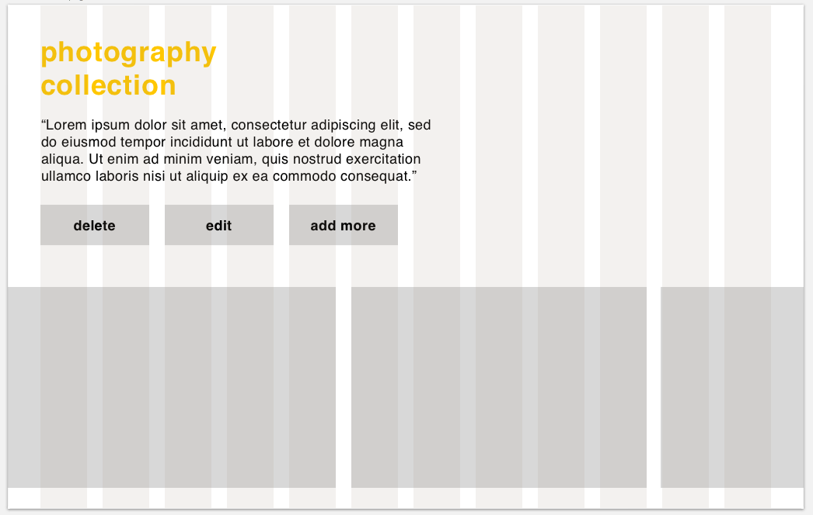

# README

## Overview:

Photography Collection is a CRUD App built with React and Rails for users to browse and create profiles for photographers that inspire them. It encourages users to add and edit to this photography collection for archival growth. 

## Technologies Used: 

- Ruby on Rails
- React
- Configuration
- database creation
- axios
- superagent

## Take a look at some code:

```javascript

    componentDidMount(){
        axios.get(`https://mysterious-scrubland-59456.herokuapp.com/projects/${this.props.match.params.id}`)
        .then((res) => {
            this.setState({
                id: res.data.id,
                title: res.data.title,
                description: res.data.description, 
                image_urlFirst: res.data.image_urlFirst, 
                image_urlSecond: res.data.image_urlSecond
            })
        })
        .catch(err => console.log(err));
    }

    handleInputChange(event) {
        event.preventDefault();
        const name = event.target.name;
        const value = event.target.value;
        this.setState({
            [name]:value,
        });
    }
    render(){  
        let path = '/projects/' + this.props.match.params.id
        return(
            <div className="edit-project-form">
                <Link to={path}><h2>←{this.state.title}</h2></Link>
                <p>{this.state.description}</p>
                <ImagesGridGallery  id = {this.props.match.params.id} />
            </div>
        )
    }
}

```

## Wireframes:




## Made By: 

Lenora Rigoni with a little help from my friends... at GA!